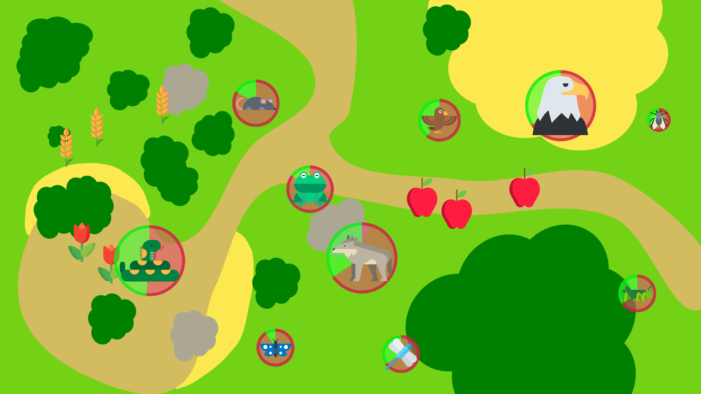

Robot Learning Tutoring -- Food Chain Game
==========================================

*This work is heavily based on Séverin Lemaignan's [Free-play Sandbox](
https://github.com/freeplay-sandbox/qt-gui). It is designed to be used with the
[Robot Controller](https://github.com/emmanuel-senft/freeplay-sandbox-ros-sparc) and the [Teacher's interface](https://github.com/emmanuel-senft/freeplay-sandbox-qt-supervisor).*

Pre-requisites
--------------

The Food Chain Game depends on 2 QtQuick extensions:

- [Box2D for QtQuick](https://github.com/qml-box2d/qml-box2d) for 2D physics
- my own [ROS plugin for QtQuick](https://github.com/emmanuel-senft/ros-qml-plugin)
(adapted from Séverin Lemaignan's)

Install both before running the game.

Installation
------------

Simply open the Qt project from QtCreator and run it from there.

Usage
-----

See [the Robot Controller repository](https://github.com/emmanuel-senft/freeplay-sandbox-ros-sparc) for detailed usage.

Game
----

This game is designed to teach children about food chains, what animal eats.
During the game, the child has to keep animals alive by moving them and feeding
them and a robot can help them by provided feedback, hints or guidance. The
game stops when three or more animals have their energy run out.

An interaction starts with demographic questions, a pre-test to evaluate the
child's knowledge and a tutorial (aided by an experimenter). Then, the child
plays for two sessions of the game, followed by a mid-test, two additional
sessions and a final post-test.
